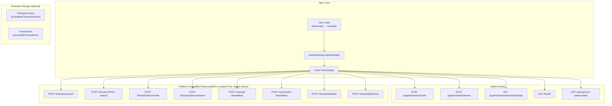

# DESIGN.md

## Design Principles

1. **Thin Adapter, Not a Framework** — We wrap LangGraph, not replace it. All graph logic stays in LangGraph.
2. **Zero Boilerplate** — `register()` + `function_app` is the entire API surface.
3. **LangGraph Conventions First** — Input/output contracts follow LangGraph's patterns (messages, config, stream_mode).
4. **Azure Functions Native** — Use the v2 programming model directly, no intermediate web framework.
5. **Checkpointer Agnostic** — Users bring their own checkpointer; we pass config through.

## Architecture



## Key Decisions

### 1. Compiled graphs as intended input
Registration enforces only the `InvocableGraph` protocol (requiring `invoke()`), so any object satisfying the protocol works. In practice, users call `.compile()` before registering because compiled graphs carry configured checkpointers and validated graph structure. The library does not import or check for `CompiledStateGraph` directly.

### 2. SSE streaming as buffered response (v0.1)
Azure Functions doesn't natively support true SSE streaming (no chunked transfer encoding in the Python worker). In v0.1, we buffer all stream events and return them as a single SSE-formatted response. This is functional but not truly streaming.

Future versions may use Durable Functions fan-out or WebSocket support to enable true streaming.

**⚠️ User expectation**: The SSE endpoints use "stream" in their path names and return `text/event-stream` content type, but responses are **buffered end-to-end** by the Azure Functions Python worker. Users should expect complete SSE-formatted responses delivered at once, not incremental token-by-token delivery. This is a platform limitation, not a design choice. When Azure Functions Python HTTP streaming stabilises, true incremental delivery will be implemented.

### 3. Thread ID in request body config (native routes)
For native routes (`/graphs/{name}/invoke`, etc.), `thread_id` is passed in `config.configurable.thread_id`, not as a URL path parameter. This keeps the native API surface minimal and compatible with LangGraph's client patterns. Platform-compatible routes use path parameters (`/threads/{thread_id}/...`) to match the LangGraph Platform REST API.

### 4. No Durable Functions dependency (v0.1)
The v0.1 release is HTTP-only. This keeps the dependency footprint small and the mental model simple. Durable Functions can be added later for timeout extension and fan-out patterns.

### 5. Per-graph auth override (v0.2)
Each graph registration can override the app-level `auth_level`. This enables mixed-auth deployments where public-facing graphs use `ANONYMOUS` while admin graphs require `FUNCTION` keys. The override is stored per-registration and applied at route creation time.

### 6. State endpoint via StatefulGraph protocol (v0.2)
Graphs that implement `get_state(config)` (i.e., graphs compiled with a checkpointer) expose a `GET /graphs/{name}/threads/{thread_id}/state` endpoint. This uses a new `StatefulGraph` protocol added to `protocols.py`, keeping the protocol-based design consistent.

### 7. Azure Blob Storage checkpointer (v0.4)

**Context**: LangGraph's built-in `MemorySaver` loses state on process restart. Azure Functions are stateless — each invocation may run on a different instance. Users need durable checkpoint persistence.

**Decision**: Implement `AzureBlobCheckpointSaver` as an optional extra (`azure-functions-langgraph[azure-blob]`). Each checkpoint is stored as a hierarchy of blobs: `{thread_id}/{checkpoint_ns}/{checkpoint_id}/checkpoint.bin`, with separate blobs for channel values and pending writes. A `latest.json` hint blob accelerates lookups.

**Consequences**: Checkpoint data survives restarts and scales across instances. Blob Storage provides high throughput and automatic geo-replication. The `azure-storage-blob` dependency is optional — import fails with a helpful message if not installed.

**Non-goals**: Async I/O (synchronous for v0.4), concurrent-writer conflict resolution (single-writer assumed).

**⚠️ Concurrency constraint**: The checkpointer assumes a single writer per thread. Concurrent writes to the same thread from multiple Azure Functions instances may corrupt checkpoint data. The write order (values -> metadata -> checkpoint commit marker -> latest hint) is designed for recoverability under single-writer semantics only. If multi-writer support is needed, add blob lease or ETag coordination. For production deployments with multiple instances, ensure serialized access to each thread (e.g., via queue-triggered processing or external locking).

### 8. Azure Table Storage thread store (v0.4)

**Context**: `InMemoryThreadStore` loses thread metadata on restart. Thread lifecycle (create, search, count, delete) needs to persist across Azure Functions instances.

**Decision**: Implement `AzureTableThreadStore` as an optional extra (`azure-functions-langgraph[azure-table]`). Single-partition design (`PartitionKey="thread"`) with client-side filtering for metadata subset matching and status filters.

**Consequences**: Thread records persist across restarts. Table Storage is low-cost and low-latency for key-value lookups. Client-side filtering works well for <100K threads; at scale, the single partition may become a bottleneck.

**Non-goals**: Server-side metadata querying (Azure Table OData filters don't support nested JSON), multi-partition sharding.

**Scale envelope**: The single-partition design works well for up to ~100K threads. At that scale:
- Azure Table Storage throughput limit of ~2,000 entities/sec per partition applies.
- Client-side metadata filtering for `search()` and `count()` becomes progressively expensive as all entities must be scanned.
- Consider migrating to a multi-partition design, Azure Cosmos DB, or a dedicated database when approaching these limits.

### 9. Threadless runs (v0.4)

**Context**: The LangGraph SDK supports `runs.wait(None, ...)` and `runs.stream(None, ...)` for fire-and-forget executions that don't need a persistent thread.

**Decision**: Add `POST /runs/wait` and `POST /runs/stream` endpoints. These clone the registered graph with `checkpointer=None`, producing a stateless execution. Client-supplied `thread_id` in config is rejected with 422 to prevent semantic confusion.

**Consequences**: SDK clients can run graphs without pre-creating threads. No checkpoint is saved, so the execution is truly ephemeral. The thread store is not modified by threadless runs.

**Non-goals**: Persisting threadless run results, associating threadless runs with thread records.

### 10. Protocol-based capability detection (v0.4)

**Context**: v0.4 adds `update_state()` and `get_state_history()` endpoints, but not all graphs support these operations.

**Decision**: Add `UpdatableStateGraph` and `StateHistoryGraph` protocols to `protocols.py`, each with `@runtime_checkable`. Route handlers use `isinstance()` checks to return 409 when a graph doesn't support the operation.

**Consequences**: Graceful degradation — graphs without these capabilities still work for all other endpoints. New protocols follow the same pattern as existing `StatefulGraph` and `StreamableGraph`.

### 11. Ecosystem responsibility boundaries

**Context**: The Azure Functions Python DX Toolkit has grown to multiple packages with overlapping capabilities.

**Decision**: Establish clear responsibility boundaries:
- `azure-functions-langgraph` owns LangGraph runtime exposure (graph deployment, invoke, stream, threads, runs, state)
- `azure-functions-validation` owns request/response validation and serialization
- `azure-functions-openapi` owns API documentation (OpenAPI spec generation, Swagger UI)

**Consequences**: The built-in `GET /api/openapi.json` endpoint is deprecated in v0.4.x and will be removed in favor of the dedicated `azure-functions-openapi` package in v0.5.0. A bridge module (`azure_functions_langgraph.openapi`) will allow users to register LangGraph endpoints with the external openapi package.

**Non-goals**: Absorbing validation or documentation concerns into this package.

### 12. Single-writer constraint for thread operations

**Context**: Thread-assistant binding uses a read-then-write pattern: the first run on a thread binds it to an assistant, and this binding is immutable. However, the binding is not atomic — there is an inherent TOCTOU (time-of-check-time-of-use) race between reading the current binding and updating it.

**Decision**: Document single-writer-per-thread as a supported constraint. For `InMemoryThreadStore` (single-process), the existing `RLock` provides adequate protection. For durable backends (`AzureTableThreadStore`), concurrent first-run requests on the same thread could result in conflicting bindings.

**Consequences**: Users deploying to multi-instance Azure Functions must ensure that concurrent writes to the same thread are avoided (e.g., queue-based serialization, or accepting that the last-writer-wins). A future version may add atomic compare-and-set to the `ThreadStore` protocol.

**Non-goals**: Lock-free concurrent thread mutation, distributed locking.

## Non-Goals

1. **No runtime orchestration** — This package exposes LangGraph graphs as Azure Functions HTTP endpoints. It does not orchestrate graph composition, tool management, or agent logic. Those concerns belong in LangGraph itself.

2. **No validation framework** — Request/response validation beyond transport-level safety checks (body size, input depth/node count, graph name format) belongs in `azure-functions-validation`. This package validates only what is needed for safe HTTP handling.

3. **No OpenAPI ownership** — API documentation and spec generation belong in `azure-functions-openapi`. This package provides metadata for the bridge module but never generates OpenAPI specs itself. The deprecated built-in `_build_openapi()` will be removed in v1.0.

4. **No LangGraph Platform replacement** — This is a deployment adapter, not a competing platform. It mirrors SDK shapes for client compatibility, not to replicate LangGraph Platform functionality.

5. **No custom storage engines** — Storage implementations (`AzureBlobCheckpointSaver`, `AzureTableThreadStore`) are adapters for Azure services. They are not a generic storage framework.

## Module Structure

```
src/azure_functions_langgraph/
├── __init__.py              # Package init, lazy imports, __version__
├── app.py                   # LangGraphApp class, route registration
├── _handlers.py             # Native route handlers (invoke, stream, state)
├── _validation.py           # Transport-agnostic request validators
├── contracts.py             # Pydantic request/response models
├── protocols.py             # Protocol interfaces (LangGraphLike, StatefulGraph, etc.)
├── py.typed                 # PEP 561 marker
├── platform/                # LangGraph Platform API compatibility layer (v0.3+)
│   ├── __init__.py
│   ├── contracts.py         # Platform API Pydantic models (Thread, Run, Assistant, etc.)
│   ├── routes.py            # SDK-compatible HTTP route handlers
│   ├── stores.py            # ThreadStore protocol + InMemoryThreadStore
│   └── _sse.py              # SSE event formatting
├── checkpointers/           # Persistent checkpoint storage (v0.4+)
│   ├── __init__.py          # Lazy-loading package
│   └── azure_blob.py        # AzureBlobCheckpointSaver (Azure Blob Storage)
└── stores/                  # Persistent thread storage (v0.4+)
    ├── __init__.py          # Lazy-loading package
    └── azure_table.py       # AzureTableThreadStore (Azure Table Storage)
```

## Testing Strategy

- Unit tests use `FakeCompiledGraph` and `FakeStatefulGraph` mock objects
- SDK compatibility tests use real `langgraph_sdk.SyncLangGraphClient` via `httpx.MockTransport`
- Integration tests use real `StateGraph` compiled graphs with `MemorySaver` and mocked Azure backends
- Persistent storage integration tests verify end-to-end flows with restart simulation
- No real LLM calls in any tests
- 645 tests, 91%+ coverage as of v0.4.0
- Coverage threshold enforced at 90% (`fail_under = 90`)


## Sources

- [Azure Functions Python developer reference](https://learn.microsoft.com/en-us/azure/azure-functions/functions-reference-python)
- [Azure Functions HTTP trigger](https://learn.microsoft.com/en-us/azure/azure-functions/functions-bindings-http-webhook-trigger)
- [Supported languages in Azure Functions](https://learn.microsoft.com/en-us/azure/azure-functions/supported-languages)
- [Azure Blob Storage documentation](https://learn.microsoft.com/en-us/azure/storage/blobs/)
- [Azure Table Storage documentation](https://learn.microsoft.com/en-us/azure/storage/tables/)
- [LangGraph documentation](https://langchain-ai.github.io/langgraph/)

## See Also

- [azure-functions-validation — Architecture](https://github.com/yeongseon/azure-functions-validation) — Request/response validation pipeline
- [azure-functions-openapi — Architecture](https://github.com/yeongseon/azure-functions-openapi) — OpenAPI spec generation
- [azure-functions-logging — Architecture](https://github.com/yeongseon/azure-functions-logging) — Structured logging with contextvars
- [azure-functions-doctor — Architecture](https://github.com/yeongseon/azure-functions-doctor) — Pre-deploy diagnostic CLI
- [azure-functions-scaffold — Architecture](https://github.com/yeongseon/azure-functions-scaffold) — Project scaffolding CLI
