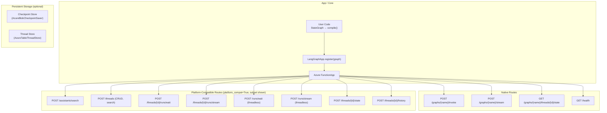

# DESIGN.md

## Design Principles

1. **Thin Adapter, Not a Framework** — We wrap LangGraph, not replace it. All graph logic stays in LangGraph.
2. **Zero Boilerplate** — `register()` + `function_app` is the entire API surface.
3. **LangGraph Conventions First** — Input/output contracts follow LangGraph's patterns (messages, config, stream_mode).
4. **Azure Functions Native** — Use the v2 programming model directly, no intermediate web framework.
5. **Checkpointer Agnostic** — Users bring their own checkpointer; we pass config through.

## Architecture


```mermaid
flowchart TB
    subgraph App ["App / Core"]
        UC["User Code\nStateGraph → compile()"] --> REG["LangGraphApp.register(graph)"]
        REG --> FA["Azure FunctionApp"]
    end

    subgraph Native ["Native Routes"]
        FA --> INV["POST /graphs/{name}/invoke"]
        FA --> STR["POST /graphs/{name}/stream"]
        FA --> GST["GET /graphs/{name}/threads/{id}/state"]
        FA --> HLT["GET /health"]
    end

    subgraph Platform ["Platform-Compatible Routes (platform_compat=True, subset shown)"]
        FA --> AST["POST /assistants/search"]
        FA --> THR["POST /threads (CRUD, search)"]
        FA --> RUN["POST /threads/{id}/runs/wait"]
        FA --> RUNS["POST /threads/{id}/runs/stream"]
        FA --> TLR["POST /runs/wait (threadless)"]
        FA --> TLS["POST /runs/stream (threadless)"]
        FA --> UST["POST /threads/{id}/state"]
        FA --> HST["POST /threads/{id}/history"]
    end

    subgraph Storage ["Persistent Storage (optional)"]
        CKP["Checkpoint Store\n(AzureBlobCheckpointSaver)"]
        THS["Thread Store\n(AzureTableThreadStore)"]
    end
```

## Key Decisions

### 1. Compiled graphs as intended input
Registration enforces only the `InvocableGraph` protocol (requiring `invoke()`), so any object satisfying the protocol works. In practice, users call `.compile()` before registering because compiled graphs carry configured checkpointers and validated graph structure. The library does not import or check for `CompiledStateGraph` directly.

### 2. SSE streaming as buffered response
This adapter buffers all stream events and returns them as a single SSE-formatted response. This is **the adapter's current implementation choice** given its classic `HttpRequest`/`HttpResponse` model — not an Azure Functions platform limitation. This is functional but not truly streaming.

Future versions may adopt the app-wide FastAPI/ASGI streaming model (`azurefunctions-extensions-http-fastapi`, runtime 4.34.1+) to enable true streaming; because that mode cannot be mixed with the classic-model routes this package uses today, it is a dedicated architecture spike rather than a drop-in.

**⚠️ User expectation**: The SSE endpoints use "stream" in their path names and return `text/event-stream` content type, but responses are **buffered end-to-end**. Users should expect complete SSE-formatted responses delivered at once, not incremental token-by-token delivery. True incremental streaming exists on Azure Functions Python v2 but requires the app-wide FastAPI/streaming model, which is incompatible with the current classic-model surface — so it is tracked as a separate architecture spike, not a platform blocker.

### 3. Thread ID in request body config (native routes)
For native routes (`/graphs/{name}/invoke`, etc.), `thread_id` is passed in `config.configurable.thread_id`, not as a URL path parameter. This keeps the native API surface minimal and compatible with LangGraph's client patterns. Platform-compatible routes use path parameters (`/threads/{thread_id}/...`) to match the LangGraph Platform REST API.

### 4. No Durable Functions dependency (v0.1)
The v0.1 release is HTTP-only. This keeps the dependency footprint small and the mental model simple. Durable Functions can be added later for timeout extension and fan-out patterns.

### 5. Per-graph auth override (v0.2)
Each graph registration can override the app-level `auth_level`. This enables mixed-auth deployments where public-facing graphs use `ANONYMOUS` while admin graphs require `FUNCTION` keys. The override is stored per-registration and applied at route creation time.

### 6. State endpoint via StatefulGraph protocol (v0.2)
Graphs that implement `get_state(config)` (i.e., graphs compiled with a checkpointer) expose a `GET /graphs/{name}/threads/{thread_id}/state` endpoint. This uses a new `StatefulGraph` protocol added to `protocols.py`, keeping the protocol-based design consistent.

### 7. Azure Blob Storage checkpointer (v0.4)

**Context**: LangGraph's built-in `MemorySaver` loses state on process restart. Azure Functions are stateless — each invocation may run on a different instance. Users need durable checkpoint persistence.

**Decision**: Implement `AzureBlobCheckpointSaver` as an optional extra (`azure-functions-langgraph[azure-blob]`). Each checkpoint is stored as a hierarchy of blobs: `{thread_id}/{checkpoint_ns}/{checkpoint_id}/checkpoint.bin`, with separate blobs for channel values and pending writes. A `latest.json` hint blob accelerates lookups.

**Consequences**: Checkpoint data survives restarts and scales across instances. Blob Storage provides high throughput and automatic geo-replication. The `azure-storage-blob` dependency is optional — import fails with a helpful message if not installed.

**Non-goals**: Async I/O (synchronous for v0.4), concurrent-writer conflict resolution (single-writer assumed).

**⚠️ Concurrency constraint**: The checkpointer assumes a single writer per thread. Concurrent writes to the same thread from multiple Azure Functions instances may corrupt checkpoint data. The write order (values -> metadata -> checkpoint commit marker -> latest hint) is designed for recoverability under single-writer semantics only. If multi-writer support is needed, add blob lease or ETag coordination. For production deployments with multiple instances, ensure serialized access to each thread (e.g., via queue-triggered processing or external locking).

### 8. Azure Table Storage thread store (v0.4)

**Context**: `InMemoryThreadStore` loses thread metadata on restart. Thread lifecycle (create, search, count, delete) needs to persist across Azure Functions instances.

**Decision**: Implement `AzureTableThreadStore` as an optional extra (`azure-functions-langgraph[azure-table]`). Single-partition design (`PartitionKey="thread"`) with client-side filtering for metadata subset matching and status filters.

**Consequences**: Thread records persist across restarts. Table Storage is low-cost and low-latency for key-value lookups. Client-side filtering works well for <100K threads; at scale, the single partition may become a bottleneck.

**Non-goals**: Server-side metadata querying (Azure Table OData filters don't support nested JSON), multi-partition sharding.

**Scale envelope**: The single-partition design works well for up to ~100K threads. At that scale:
- Azure Table Storage throughput limit of ~2,000 entities/sec per partition applies.
- Client-side metadata filtering for `search()` and `count()` becomes progressively expensive as all entities must be scanned.
- Consider migrating to a multi-partition design, Azure Cosmos DB, or a dedicated database when approaching these limits.

### 9. Threadless runs (v0.4)

**Context**: The LangGraph SDK supports `runs.wait(None, ...)` and `runs.stream(None, ...)` for fire-and-forget executions that don't need a persistent thread.

**Decision**: Add `POST /runs/wait` and `POST /runs/stream` endpoints. These clone the registered graph with `checkpointer=None`, producing a stateless execution. Client-supplied `thread_id` in config is rejected with 422 to prevent semantic confusion.

**Consequences**: SDK clients can run graphs without pre-creating threads. No checkpoint is saved, so the execution is truly ephemeral. The thread store is not modified by threadless runs.

**Non-goals**: Persisting threadless run results, associating threadless runs with thread records.

### 10. Protocol-based capability detection (v0.4)

**Context**: v0.4 adds `update_state()` and `get_state_history()` endpoints, but not all graphs support these operations.

**Decision**: Add `UpdatableStateGraph` and `StateHistoryGraph` protocols to `protocols.py`, each with `@runtime_checkable`. Route handlers use `isinstance()` checks to return 409 when a graph doesn't support the operation.

**Consequences**: Graceful degradation — graphs without these capabilities still work for all other endpoints. New protocols follow the same pattern as existing `StatefulGraph` and `StreamableGraph`.

### 11. Ecosystem responsibility boundaries

**Context**: The Azure Functions Python DX Toolkit has grown to multiple packages with overlapping capabilities.

**Decision**: Establish clear responsibility boundaries:
- `azure-functions-langgraph` owns LangGraph runtime exposure (graph deployment, invoke, stream, threads, runs, state)
- `azure-functions-validation-python` owns request/response validation and serialization
- `azure-functions-openapi-python` owns API documentation (OpenAPI spec generation, Swagger UI)

**Consequences**: OpenAPI support is delegated to the dedicated `azure-functions-openapi-python` package. A bridge module (`azure_functions_langgraph.openapi`) allows users to register LangGraph endpoints with the external openapi package.

**Non-goals**: Absorbing validation or documentation concerns into this package.

### 13. Auth level default

**Context**: Oracle design review flagged that `LangGraphApp` defaulting to `ANONYMOUS` creates a security risk - users copy example code into Azure without changing auth settings. The official Azure Functions Python `FunctionApp` class defaults to `FUNCTION`.

**Decision**: `LangGraphApp` defaults to `AuthLevel.FUNCTION`. Passing `auth_level=ANONYMOUS` is an explicit opt-in that emits an unconditional `UserWarning`, so an accidental anonymous surface is loud in test/CI output. All examples set `auth_level` explicitly.

**Consequences**: Deployed endpoints require a function key out of the box, matching the official Azure Functions `FunctionApp` default and closing the copy-paste-into-Azure security gap. The health surfaces are gated separately (`GET /api/health` liveness is `ANONYMOUS` by default and exposes only `{"status": "ok"}`; `GET /api/health/details` inherits `auth_level`, so the graph inventory is protected by default).

**Decision history**: The original v0.5 plan was to keep `ANONYMOUS` as the default through v0.5.x-v0.6.x for backward compatibility and only switch to `FUNCTION` in v1.0. That plan was superseded: `FUNCTION` became the default in **v0.7.3** (#243), ahead of v1.0, because the security risk of an anonymous default outweighed the backward-compatibility concern.

**Non-goals**: Environment-dependent defaults (surprising behavior), `DeprecationWarning` emission (ignored by default, creates noise without protection).

## Module Structure

```
src/azure_functions_langgraph/
├── __init__.py              # Package init, lazy imports, __version__
├── app.py                   # LangGraphApp class, route registration
├── _handlers.py             # Native route handlers (invoke, stream, state)
├── _validation.py           # Transport-agnostic request validators
├── contracts.py             # Pydantic request/response models
├── protocols.py             # Protocol interfaces (LangGraphLike, StatefulGraph, etc.)
├── py.typed                 # PEP 561 marker
├── platform/                # LangGraph Platform API compatibility layer (v0.3+)
│   ├── __init__.py
│   ├── contracts.py         # Platform API Pydantic models (Thread, Run, Assistant, etc.)
│   ├── routes.py            # SDK-compatible HTTP route handlers
│   ├── stores.py            # ThreadStore protocol + InMemoryThreadStore
│   └── _sse.py              # SSE event formatting
├── checkpointers/           # Persistent checkpoint storage (v0.4+)
│   ├── __init__.py          # Lazy-loading package
│   └── azure_blob.py        # AzureBlobCheckpointSaver (Azure Blob Storage)
└── stores/                  # Persistent thread storage (v0.4+)
    ├── __init__.py          # Lazy-loading package
    └── azure_table.py       # AzureTableThreadStore (Azure Table Storage)
```

## Testing Strategy

- Unit tests use `FakeCompiledGraph` and `FakeStatefulGraph` mock objects
- SDK compatibility tests use real `langgraph_sdk.SyncLangGraphClient` via `httpx.MockTransport`
- Integration tests use real `StateGraph` compiled graphs with `MemorySaver` and mocked Azure backends
- Persistent storage integration tests verify end-to-end flows with restart simulation
- No real LLM calls in any tests
- Extensive unit + SDK-compatibility + integration suite; coverage tracked in CI (see `pyproject.toml` for the current gate). Historical snapshot: 645 tests, 91%+ coverage as of v0.4.0.
- Coverage threshold enforced at 95% (`fail_under = 95`)


## Streaming: buffered SSE and the true-streaming migration (#378)

The `/stream` endpoints — native `POST /api/graphs/{name}/stream` and the
Platform-compatible `POST /threads/{id}/runs/stream` and `POST /runs/stream` —
return **buffered** SSE. Chunks emitted by the graph are collected during
execution and flushed as SSE events *after the run completes*; clients never
receive partial tokens incrementally. This is a deliberate design choice, not a
bug and not an Azure platform limitation. It is tracked for future migration in
[issue #378](https://github.com/yeongseon/azure-functions-langgraph-python/issues/378).

### Why buffered today

This package registers **classic** `HttpRequest`/`HttpResponse` routes via the
Azure Functions Python v2 `FunctionApp` programming model. In that model a
handler returns a single, fully-formed `HttpResponse`, so the SSE body must be
assembled in memory before it is returned. `max_stream_response_bytes` is only a
safety cap on that in-memory buffer — it does not enable incremental delivery.

### The concrete constraint

Azure Functions Python *does* support true HTTP streaming (runtime **4.34.1+**)
through the `azurefunctions-extensions-http-fastapi` extension. That extension
switches the **entire function app** to the FastAPI/ASGI model: routes become
ASGI routes served by a FastAPI/Starlette app rather than classic
`HttpRequest`/`HttpResponse` handlers. The two models **cannot be mixed** within
one function app, so adopting true streaming is an app-wide architectural change,
not a per-endpoint toggle.

### Design questions for the migration (tracked in #378)

- **Opt-in coexistence.** Can true streaming be offered as an opt-in — e.g. a
  dedicated ASGI sub-app or a separate streaming entrypoint — without forcing
  every consumer of this package onto the ASGI model? If not, the migration is a
  breaking change gated on a major version.
- **Breaking-change surface.** Moving to ASGI re-touches route registration,
  per-graph `auth_level` handling (Functions auth vs. ASGI middleware), the
  health endpoints, and the native-endpoint per-thread locking — each must be
  re-established under the FastAPI/ASGI model.
- **Streaming semantics.** Under true streaming, `stream_mode`, backpressure, and
  the meaning of `max_stream_response_bytes` (a hard buffer cap today) all need
  redefinition — likely a soft flush threshold or removal.
- **Release promise.** Core (classic, buffered) vs. Platform-compat streaming
  guarantees must stay separable so the buffered contract does not silently
  change under existing users.

Actual implementation of the ASGI migration is **out of scope for #378** — that
issue establishes the tracker and the design constraints; implementation follows
in a dedicated issue/PR once an approach is agreed.

## Sources

- [Azure Functions Python developer reference](https://learn.microsoft.com/en-us/azure/azure-functions/functions-reference-python)
- [Azure Functions HTTP trigger](https://learn.microsoft.com/en-us/azure/azure-functions/functions-bindings-http-webhook-trigger)
- [Supported languages in Azure Functions](https://learn.microsoft.com/en-us/azure/azure-functions/supported-languages)
- [Azure Blob Storage documentation](https://learn.microsoft.com/en-us/azure/storage/blobs/)
- [Azure Table Storage documentation](https://learn.microsoft.com/en-us/azure/storage/tables/)
- [LangGraph documentation](https://langchain-ai.github.io/langgraph/)

## See Also

- [azure-functions-validation-python — Architecture](https://github.com/yeongseon/azure-functions-validation-python) — Request/response validation pipeline
- [azure-functions-openapi-python — Architecture](https://github.com/yeongseon/azure-functions-openapi-python) — OpenAPI spec generation
- [azure-functions-logging-python — Architecture](https://github.com/yeongseon/azure-functions-logging-python) — Structured logging with contextvars
- [azure-functions-doctor-python — Architecture](https://github.com/yeongseon/azure-functions-doctor-python) — Pre-deploy diagnostic CLI
- [azure-functions-scaffold-python — Architecture](https://github.com/yeongseon/azure-functions-scaffold-python) — Project scaffolding CLI
