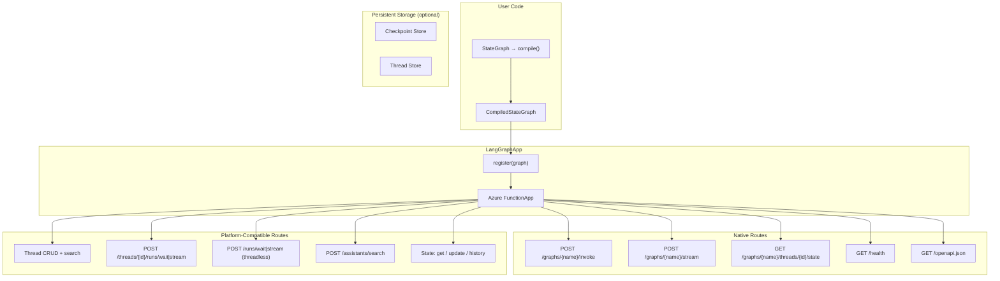
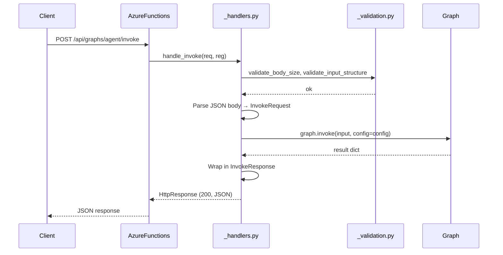
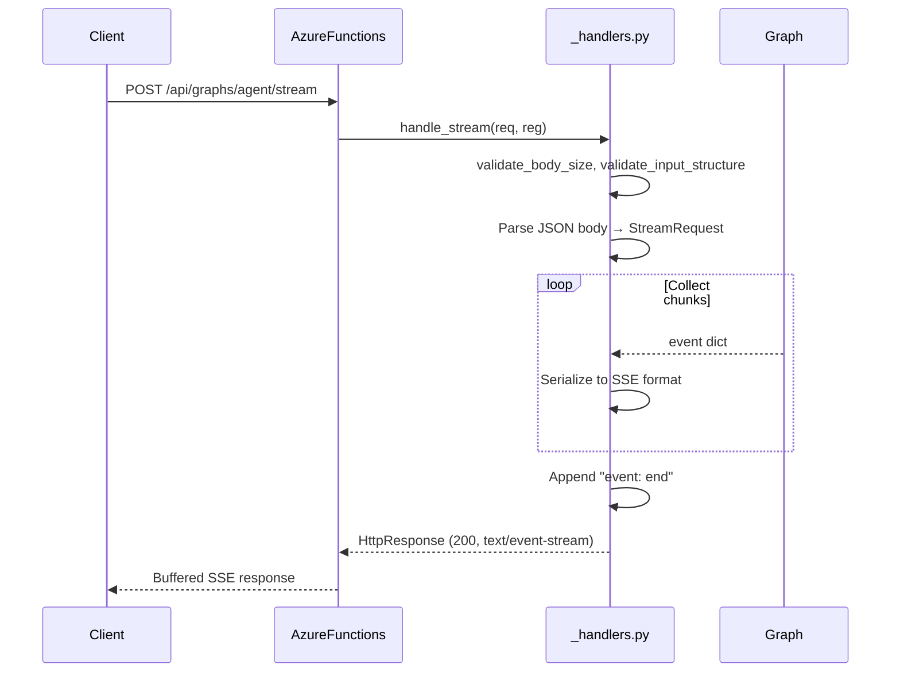
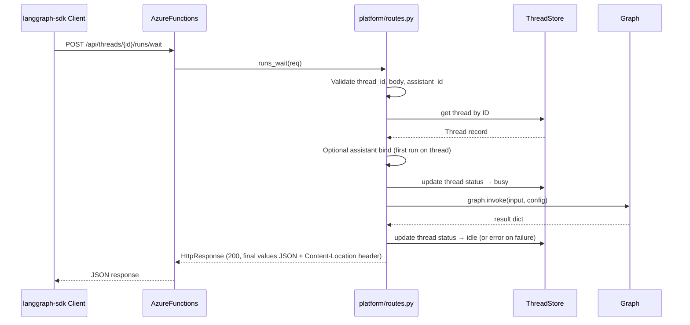
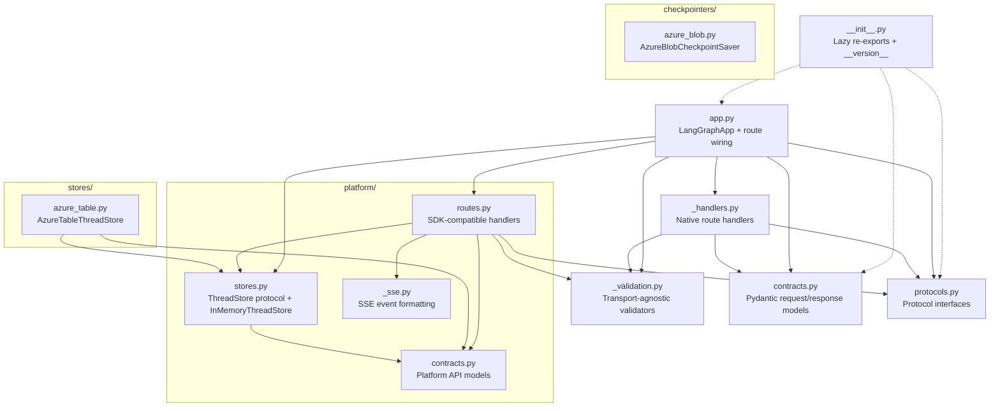

# Architecture

## Overview

`azure-functions-langgraph` is a thin deployment adapter. It bridges LangGraph compiled graphs and Azure Functions HTTP endpoints without adding intermediate abstractions.

Platform-compatible routes are registered when `platform_compat=True`, enabling the official `langgraph-sdk` Python client to communicate with Azure Functions–hosted graphs.

## Design Objectives

- **Thin adapter, not a framework** — wrap LangGraph, don't replace it. All graph logic stays in LangGraph.
- **Zero boilerplate** — `register()` + `function_app` is the entire API surface.
- **LangGraph conventions first** — input/output contracts follow LangGraph's patterns (messages, config, stream_mode).
- **Azure Functions native** — use the v2 programming model directly, no intermediate web framework.
- **Checkpointer agnostic** — users bring their own checkpointer; config is passed through.

## High-Level Flow

### Invoke

### Stream (buffered)

### Platform: Thread Run (SDK-compatible)

## Module Boundaries (key import edges)

### `app.py`

The core module. Contains:

- `LangGraphApp` — main class (dataclass) that holds graph registrations and builds an `azure.functions.FunctionApp`.
- `_GraphRegistration` — internal record for a registered graph.
- Route wiring — delegates to `_handlers.py` for native routes and `platform/routes.py` for SDK-compatible routes.
- `_build_openapi()` — generates OpenAPI 3.0 spec from registered graphs.
- `health()` — health check handler returning registered graph list.

### `_handlers.py`

Standalone request handlers extracted from `LangGraphApp`:

- `handle_invoke()` — parses request, validates, calls `graph.invoke()`, returns JSON.
- `handle_stream()` — parses request, validates, calls `graph.stream()`, collects chunks into buffered SSE.
- `handle_state()` — retrieves thread state via `graph.get_state()` for `StatefulGraph` instances.
- `_error_response()` — consistent error response builder for native routes.

### `_validation.py`

Transport-agnostic input validators (pure functions returning error message or `None`):

- `validate_graph_name()`, `validate_body_size()`, `validate_input_structure()`, `validate_thread_id()`.
- Shared by both native handlers and platform routes.

### `contracts.py`

Pydantic v2 models for request/response validation:

- `InvokeRequest`, `InvokeResponse`, `StreamRequest` — graph operation models.
- `HealthResponse`, `GraphInfo` — health endpoint models.
- `ErrorResponse` — consistent error format.
- `StateResponse` — thread state values, next steps, metadata, config, timestamps.

### `protocols.py`

`typing.Protocol` interfaces with `@runtime_checkable`:

- `InvocableGraph` — has `invoke(input, config)`.
- `StreamableGraph` — has `stream(input, config, stream_mode)`.
- `LangGraphLike` — combines both (matches `CompiledStateGraph`).
- `StatefulGraph` — has `get_state(config)`.
- `UpdatableStateGraph` — has `update_state(config, values)`.
- `StateHistoryGraph` — has `get_state_history(config)`.

Using protocols avoids a hard import dependency on `langgraph` at the library level. Any object with the right methods works.

### `platform/`

LangGraph Platform API compatibility layer (v0.3+):

- `routes.py` — SDK-compatible HTTP route handlers for threads, runs, assistants, state operations.
- `contracts.py` — Platform API Pydantic models (Thread, Run, Assistant, Interrupt, etc.).
- `stores.py` — `ThreadStore` protocol + `InMemoryThreadStore` default implementation.
- `_sse.py` — SSE event formatting for platform streaming endpoints.

### `checkpointers/`

Persistent checkpoint storage (v0.4+):

- `azure_blob.py` — `AzureBlobCheckpointSaver` (optional extra: `azure-functions-langgraph[azure-blob]`). Stores checkpoints as blob hierarchies: `{thread_id}/{checkpoint_ns}/{checkpoint_id}/checkpoint.bin`.

### `stores/`

Persistent thread storage (v0.4+):

- `azure_table.py` — `AzureTableThreadStore` (optional extra: `azure-functions-langgraph[azure-table]`). Single-partition design with client-side filtering.

## Public API Boundary

Exported symbols (via `__all__`, all lazy-loaded via `__getattr__`):

- `LangGraphApp` — main class for graph registration and route creation
- `__version__` — package version string
- `InvokeRequest`, `InvokeResponse`, `StreamRequest` — request/response contracts
- `HealthResponse`, `GraphInfo`, `ErrorResponse`, `StateResponse` — endpoint models
- `InvocableGraph`, `StreamableGraph`, `LangGraphLike`, `StatefulGraph` — protocol interfaces

Lazy imports via `__getattr__` are a deliberate design choice: importing the package does not require `azure-functions` or `langgraph` to be installed, enabling use in environments where only contracts or protocols are needed.

Everything else (handlers, validators, platform internals, storage implementations) is implementation detail.

## Key Design Decisions

### Compiled graphs as intended input

Users typically call `.compile()` before registering. Registration enforces only the `InvocableGraph` protocol (requiring `invoke()`), so any object satisfying the protocol works — but compiled graphs are the primary expected input because they carry configured checkpointers and validated graph structure.

### Protocol-based graph acceptance

Rather than importing `CompiledStateGraph` from `langgraph`, the library uses `typing.Protocol`. This means no hard dependency on `langgraph` at import time, any object with `invoke()` and `stream()` works, and testing with mock graphs is straightforward.

### Protocol-based capability detection (v0.4)

`UpdatableStateGraph` and `StateHistoryGraph` protocols enable graceful degradation — graphs without these capabilities return 409 instead of failing. Route handlers use `isinstance()` checks with `@runtime_checkable`.

### Buffered SSE (v0.1)

Azure Functions Python worker does not support true chunked HTTP streaming. All stream events are collected into memory and returned as a single SSE-formatted response. Functional for development but not suitable for long-running streams in production.

### Platform compatibility layer (v0.3)

When `platform_compat=True`, the library registers routes that mirror the LangGraph Platform REST API, enabling the official `langgraph-sdk` Python client to work with Azure Functions–hosted graphs. This adds thread lifecycle management, SDK-compatible run endpoints, assistant listing, and state operations.

### Azure Blob Storage checkpointer (v0.4)

`AzureBlobCheckpointSaver` provides durable checkpoint persistence across Azure Functions instances. Installed as optional extra (`[azure-blob]`). Synchronous I/O, single-writer assumed.

### Azure Table Storage thread store (v0.4)

`AzureTableThreadStore` provides persistent thread metadata across restarts. Installed as optional extra (`[azure-table]`). Single-partition design works well for <100K threads.

### Threadless runs (v0.4)

`POST /runs/wait` and `POST /runs/stream` clone the graph with `checkpointer=None` for truly ephemeral executions. Client-supplied `thread_id` in config is rejected with 422 to prevent semantic confusion.

### Per-graph auth override (v0.2)

Each graph registration can override the app-level `auth_level`, enabling mixed-auth deployments.

### Thread ID in request body (native routes)

For native routes, `thread_id` is passed in `config.configurable.thread_id`, not as a URL path parameter. This keeps the native API surface minimal and matches LangGraph's client expectations. Platform-compatible routes (`/threads/{thread_id}/...`) do use path parameters to match the LangGraph Platform REST API.

## Related Documents

- [Usage Guide](usage.md)
- [Configuration](configuration.md)
- [API Reference](api.md)
- [Getting Started](getting-started.md)
- [Testing](testing.md)
- [Troubleshooting](troubleshooting.md)

## Sources

- [Azure Functions Python developer reference](https://learn.microsoft.com/en-us/azure/azure-functions/functions-reference-python)
- [Azure Functions HTTP trigger](https://learn.microsoft.com/en-us/azure/azure-functions/functions-bindings-http-webhook-trigger)
- [Supported languages in Azure Functions](https://learn.microsoft.com/en-us/azure/azure-functions/supported-languages)
- [Azure Blob Storage documentation](https://learn.microsoft.com/en-us/azure/storage/blobs/)
- [Azure Table Storage documentation](https://learn.microsoft.com/en-us/azure/storage/tables/)
- [LangGraph documentation](https://langchain-ai.github.io/langgraph/)

## See Also

- [azure-functions-validation — Architecture](https://github.com/yeongseon/azure-functions-validation) — Request/response validation pipeline
- [azure-functions-openapi — Architecture](https://github.com/yeongseon/azure-functions-openapi) — OpenAPI spec generation
- [azure-functions-logging — Architecture](https://github.com/yeongseon/azure-functions-logging) — Structured logging with contextvars
- [azure-functions-doctor — Architecture](https://github.com/yeongseon/azure-functions-doctor) — Pre-deploy diagnostic CLI
- [azure-functions-scaffold — Architecture](https://github.com/yeongseon/azure-functions-scaffold) — Project scaffolding CLI
