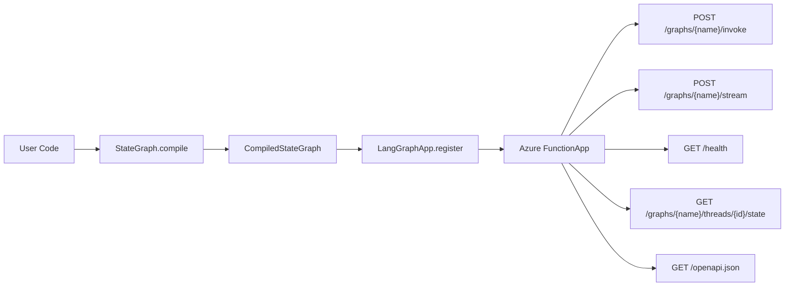
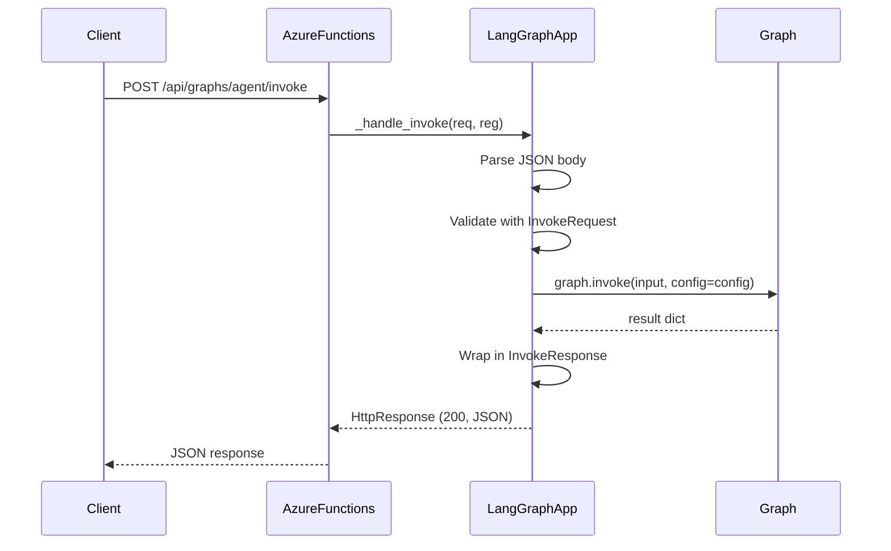
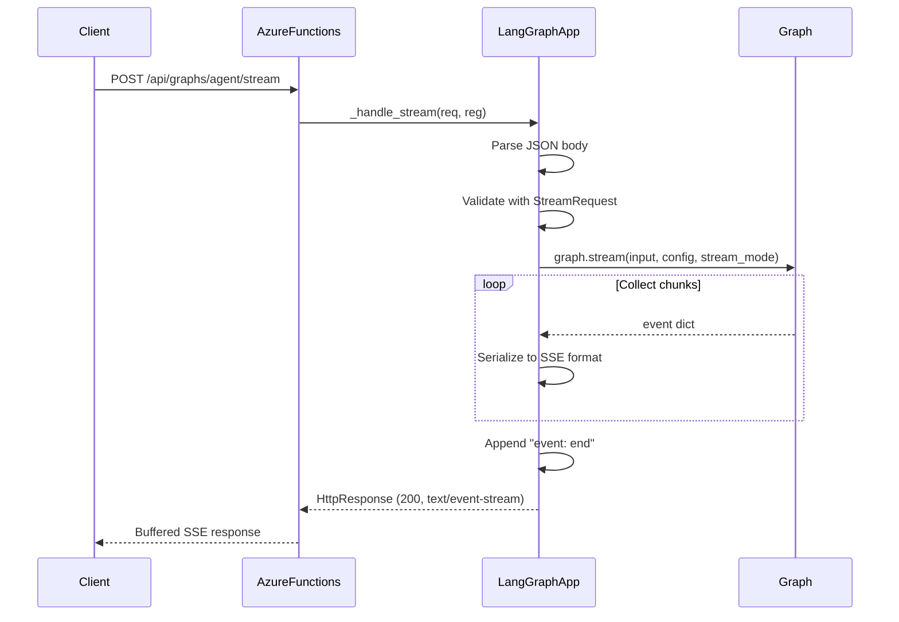

# Architecture

## Overview

`azure-functions-langgraph` is a thin deployment adapter. It bridges LangGraph compiled graphs and Azure Functions HTTP endpoints without adding intermediate abstractions.



## Request flow

### Invoke



### Stream (buffered)



## Module structure

```
src/azure_functions_langgraph/
├── __init__.py       # Package init, lazy LangGraphApp import, __version__
├── app.py            # LangGraphApp class, route registration, request handlers
├── contracts.py      # Pydantic request/response models
├── protocols.py      # Protocol interfaces (InvocableGraph, StreamableGraph, StatefulGraph, LangGraphLike)
└── py.typed          # PEP 561 marker for typed package
```

### `app.py`

The core module. Contains:

- `LangGraphApp` — main class, a dataclass that holds graph registrations and builds an `azure.functions.FunctionApp`
- `_GraphRegistration` — internal record for a registered graph
- `_handle_invoke()` — parses request, calls `graph.invoke()`, returns JSON
- `_handle_stream()` — parses request, calls `graph.stream()`, collects chunks into buffered SSE
- `_handle_state()` — retrieves thread state via `graph.get_state()` for StatefulGraph instances
- `_build_openapi()` — generates OpenAPI 3.0 spec from registered graphs
- `_handle_stream()` — parses request, calls `graph.stream()`, collects chunks into buffered SSE
- `_error_response()` — consistent error response builder

### `contracts.py`

Pydantic v2 models for request/response validation:

- `InvokeRequest` — input, config, metadata
- `StreamRequest` — input, config, stream_mode, metadata
- `InvokeResponse` — output dict
- `HealthResponse` — status + list of GraphInfo
- `ErrorResponse` — error + detail
- `GraphInfo` — name, description, has_checkpointer
- `StateResponse` — thread state values, next steps, metadata, config, timestamps
- `GraphInfo` — name, description, has_checkpointer

### `protocols.py`

`typing.Protocol` interfaces with `@runtime_checkable`:

- `InvocableGraph` — has `invoke(input, config)`
- `StreamableGraph` — has `stream(input, config, stream_mode)`
- `LangGraphLike` — combines both (matches `CompiledStateGraph`)
- `StatefulGraph` — has `get_state(config)` for thread state inspection
- `StreamableGraph` — has `stream(input, config, stream_mode)`
- `LangGraphLike` — combines both (matches `CompiledStateGraph`)

Using protocols avoids a hard import dependency on `langgraph` at the library level. Any object with the right methods works.

## Design decisions

### Accept compiled graphs only

Users must call `.compile()` before registering. This ensures:

- Checkpointer is configured before registration
- Graph validation happens at user code level
- The library does not need to know about compilation options

### Protocol-based graph acceptance

Rather than importing `CompiledStateGraph` from `langgraph`, the library uses `typing.Protocol`. This means:

- No hard dependency on `langgraph` at import time
- Any object with `invoke()` and `stream()` works
- Easy to test with mock graphs

### Buffered SSE (v0.1)

Azure Functions Python worker does not support true chunked HTTP streaming. In v0.1, all stream events are collected into memory and returned as a single SSE-formatted response. This is functional for development but not suitable for long-running streams in production.

### Thread ID in request body

Following LangGraph conventions, `thread_id` is passed in `config.configurable.thread_id`, not as a URL path parameter. This keeps the API surface minimal and matches LangGraph's native client expectations.

### Per-graph auth override (v0.2)

Each graph registration can override the app-level `auth_level`. This allows mixed-auth deployments (e.g., public-facing graphs with `ANONYMOUS` auth and admin graphs with `FUNCTION` keys).

### State endpoint via StatefulGraph (v0.2)

Graphs compiled with a checkpointer implement the `StatefulGraph` protocol (`get_state(config)`). These graphs automatically get a state inspection endpoint. The protocol check uses `isinstance()` with `@runtime_checkable`, consistent with the existing protocol pattern.
