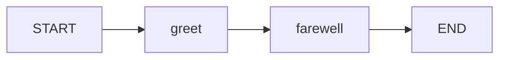

# Simple Agent Example

This example deploys a two-node LangGraph agent as Azure Functions HTTP endpoints.

Source: [`examples/simple_agent/graph.py`](https://github.com/yeongseon/azure-functions-langgraph-python/blob/main/examples/simple_agent/graph.py)

## Graph overview

The graph has two nodes connected sequentially:



- **greet** — generates a greeting from the last message
- **farewell** — appends a farewell message

## Step 1: Define the state

```python
from typing_extensions import TypedDict


class AgentState(TypedDict):
    messages: list[dict[str, str]]
    greeting: str
```

The state has two fields:

- `messages` — conversation history
- `greeting` — intermediate greeting string passed between nodes

## Step 2: Define node functions

```python
from typing import Any


def greet(state: AgentState) -> dict[str, Any]:
    """First node — generates a greeting."""
    user_msg = state["messages"][-1]["content"] if state["messages"] else "stranger"
    return {"greeting": f"Hello, {user_msg}!"}


def farewell(state: AgentState) -> dict[str, Any]:
    """Second node — appends farewell to messages."""
    return {
        "messages": state["messages"]
        + [{"role": "assistant", "content": f"{state['greeting']} Goodbye!"}]
    }
```

## Step 3: Build and compile the graph

```python
from langgraph.graph import END, START, StateGraph

builder = StateGraph(AgentState)
builder.add_node("greet", greet)
builder.add_node("farewell", farewell)
builder.add_edge(START, "greet")
builder.add_edge("greet", "farewell")
builder.add_edge("farewell", END)

compiled_graph = builder.compile()
```

## Step 4: Deploy with LangGraphApp

```python
from azure_functions_langgraph import LangGraphApp

langgraph_app = LangGraphApp()
langgraph_app.register(
    graph=compiled_graph,
    name="simple_agent",
    description="A simple two-node greeting agent",
)

func_app = langgraph_app.function_app
```

## Testing it

Start the function app locally:

```bash
func start
```

Invoke the agent:

```bash
curl -X POST http://localhost:7071/api/graphs/simple_agent/invoke \
  -H "Content-Type: application/json" \
  -d '{"input": {"messages": [{"role": "human", "content": "World"}], "greeting": ""}}'
```

Expected response:

```json
{
    "output": {
        "messages": [
            {"role": "human", "content": "World"},
            {"role": "assistant", "content": "Hello, World! Goodbye!"}
        ],
        "greeting": "Hello, World!"
    }
}
```

Check health:

```bash
curl http://localhost:7071/api/health
```

```json
{
    "status": "ok",
    "graphs": [
        {
            "name": "simple_agent",
            "description": "A simple two-node greeting agent",
            "has_checkpointer": false
        }
    ]
}
```

## Full source

See [`examples/simple_agent/graph.py`](https://github.com/yeongseon/azure-functions-langgraph-python/blob/main/examples/simple_agent/graph.py) for the complete working example.
